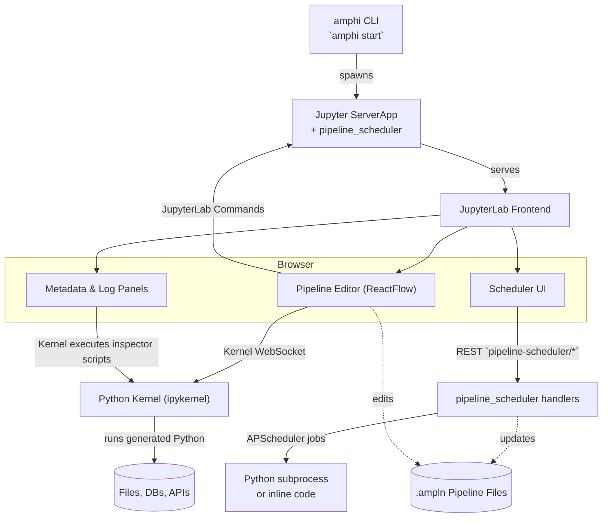
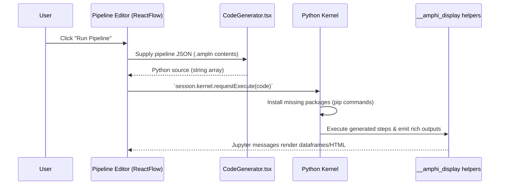
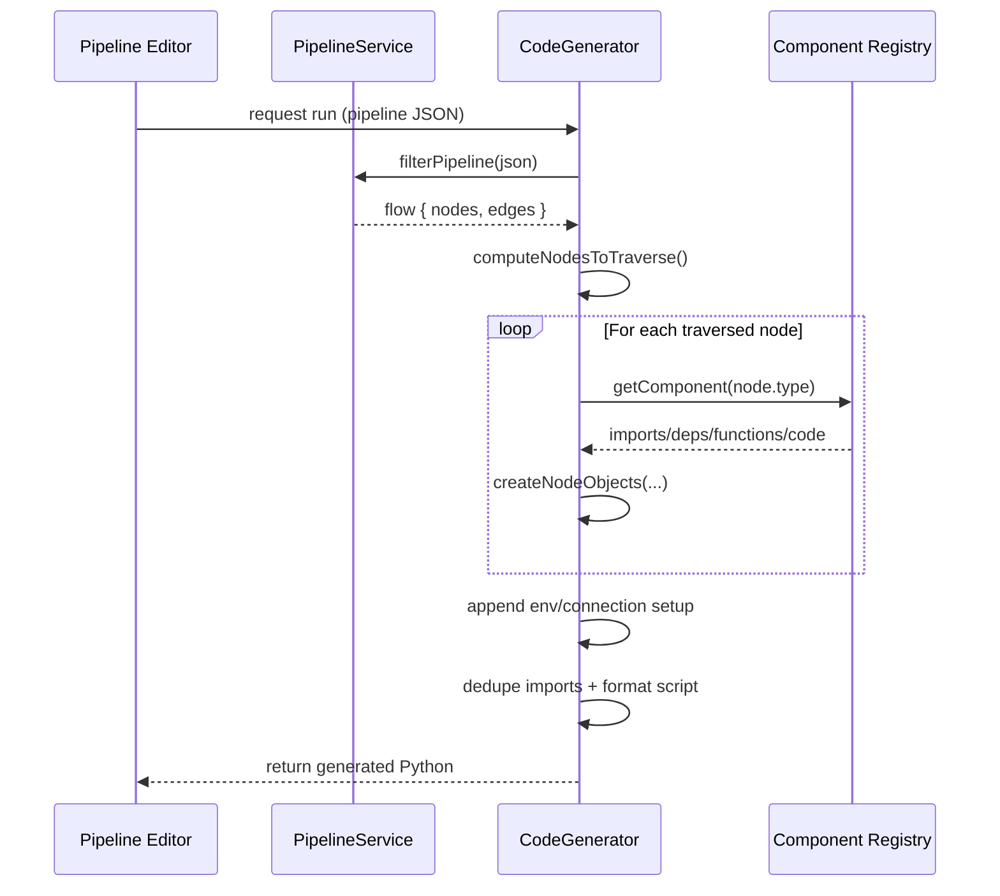
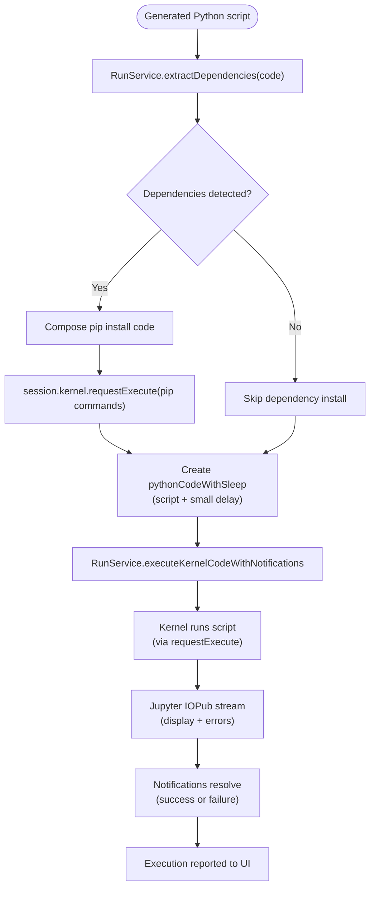

# Amphi ETL Architecture Design

This document describes the architecture of the Amphi ETL project that lives in `/home/chris/repo/workflow-management/amphi-etl`. It explains how the monorepo is organised, how the frontend and backend cooperate, and how pipeline definitions flow from the visual designer into executable Python within JupyterLab.

## Monorepo Overview
- **`amphi-etl/`** – Python distribution that ships the standalone Amphi application. It bundles the JupyterLab extensions, applies custom lab settings, and exposes the `amphi start` CLI that launches JupyterLab with the required configuration.
- **`jupyterlab-amphi/`** – Source for the core Amphi JupyterLab extension. It contains the React-based pipeline editor (`packages/pipeline-editor`), component registry & code generation logic (`packages/pipeline-components-*`), metadata/log panels, and shared UI assets.
- **`amphi-scheduler/`** – Optional scheduling extension. It provides both the React UI (`packages/pipeline-scheduler`) and the Python server extension (`packages/pipeline-scheduler/pipeline_scheduler`) that executes APScheduler jobs against saved pipelines or generated code.
- **Shared configuration** – `config/labconfig`, `config/settings`, and `config/server-config` in `amphi-etl/` customise the Lab experience (theme, disabled menus, enabled server extensions such as `pipeline_scheduler`, and `jupyterfs` as the content manager).

The JavaScript/TypeScript packages are managed with Lerna/JLPM, compiled into static assets, and copied into the Python wheels under `amphi/<extension>/` during the Hatch build hooks described in each `pyproject.toml`.

## Runtime Architecture


Key points:
- The CLI is thin: `amphi/main.py` simply shells out to `python -m jupyter lab` with workspace, IP, and port parameters.
- The server extension stack enables `jupyterfs` for workspace abstraction and the custom `pipeline_scheduler` REST API.
- Frontend packages are standard prebuilt JupyterLab extensions that run entirely in the browser but talk to the Jupyter server (for persistence) and to the active kernel (for execution).

## Pipeline Assets & Data Model
- **Pipeline documents** are stored as `.ampln` files (JSON). New files are scaffolded in `pipeline-editor/src/index.ts` with:
  ```json
  {
    "doc_type": "Amphi Pipeline",
    "version": "1",
    "pipelines": [
      {
        "id": "primary",
        "flow": {
          "nodes": [],
          "edges": [],
          "viewport": {"x": 0, "y": 0, "zoom": 1}
        },
        "app_data": {"ui_data": {"comments": []}, "version": 1, "runtime_type": "LOCAL"},
        "runtime_ref": "python"
      }
    ]
  }
  ```
- **Flow representation** – The visual editor is built on React Flow. Nodes and edges in the canvas serialise directly into the `flow` object. `PipelineService.filterPipeline` (see `pipeline-components-manager/src/PipelineService.tsx`) strips the JSON down to `{nodes: [{id, type, data}], edges: [{id, source, target, targetHandle}]}` for downstream processing.
- **Component metadata** – Each node type is provided by component registries in `pipeline-components-core`, `pipeline-components-local`, and other packages. They encapsulate form schemas, code generators, runtime hints, and dependency declarations.

## Execution Flow (Frontend ➝ Kernel)


### Output Format from the Flow Designer to JupyterLab
1. The ReactFlow canvas saves the graph as the `.ampln` JSON shown above.
2. When a run is requested, `CodeGenerator.generateCodeForNodes` (in `pipeline-components-manager/src/CodeGenerator.tsx`) converts that JSON into executable Python. The output is a list of strings ultimately joined into a single script:
   ```python
   # Source code generated by Amphi
   # Additional dependencies: duckdb, pandas
   import pandas as pd
   from duckdb import connect
   ...
   __amphi_display(my_dataframe, dfName="MyStep", nodeId="node-3")
   ```
   - The header lines communicate metadata and capture third-party dependencies.
   - Every upstream node produces either import statements, helper functions, or step-specific code inline.
   - Display hooks (`__amphi_display`, `_amphi_display_documents_as_html`) are appended so that results surface in the UI.
3. The joined Python string is the payload sent to `session.kernel.requestExecute`. No intermediate binary format is used—the contract is “pipeline JSON ➝ generated Python ➝ Jupyter kernel”.

### Code Generation Details (JSON → Python)
The conversion from the pipeline JSON to executable Python happens inside `jupyterlab-amphi/packages/pipeline-components-manager/src/CodeGenerator.tsx`. The flow is:



1. **Read & normalise the graph**
   - `pipeline-editor` passes the full `.ampln` JSON string.
   - `PipelineService.filterPipeline` trims the document to a lightweight `{nodes, edges}` model (`PipelineService.tsx:5`), ensuring only identifiers, component types, and user-supplied `data` flow into the generator.

2. **Resolve traversal order & context**
   - `CodeGenerator.computeNodesToTraverse` (used by `generateCodeForNodes`) builds a topological walk from one or more entry nodes through to the requested target.
   - Helper maps (`nodesToTraverse`, `nodesMap`) keep the filtered nodes accessible for lookups such as `findPreviousNodeId`, while special node types (environment variables, connections) are flagged for later.

3. **Materialise node objects**
   - Each node type is backed by a component descriptor pulled from the registry (`componentService.getComponent(node.type)`).
   - `createNodeObjects` invokes descriptor hooks to gather:
     - `imports` – Python import statements,
     - `dependencies` – third-party packages to install (`pip`),
     - `functions` – helper definitions to emit once,
     - `code` – the executable snippet tailored with `node.data`,
     - `outputName` – variable name for downstream references (auto-generated if missing).

4. **Assemble ordered Python**
   - Traversal order drives how snippets are appended to `codeList`, ensuring dependencies precede consumers.
   - When the target node is reached:
     - Processor/input nodes append `_amphi_display_documents_as_html(...)` or `__amphi_display(...)` so results render in the UI.
     - Output nodes wrap the accumulated script in a `try/except` that raises on failure after logging a message.

5. **Augment with environment & connection blocks**
   - Deferred env/connection nodes generate credential setup code and supplementary imports so pipelines can run in the kernel without manual preamble.

6. **Final formatting**
   - A timestamp header (`# Source code generated by Amphi`) and dependency banner (`# Additional dependencies: …`) top the script.
   - Imports and helper functions are deduplicated via `Set`s, and `formatVariables` stabilises auto-named variables.
   - `generateCode` returns a single newline-joined string, while `generateCodeUntil` exposes incremental chunks for “run until node” and inspector scenarios.

Because each component encapsulates its own code template, extending Amphi with new blocks simply means implementing the descriptor interface; the core generator remains unchanged while producing deterministic, readable Python that mirrors the original graph.

### Python Execution Pipeline
Once the script is generated, the pipeline editor hands it to `RunService` (defined in `pipeline-editor/src/RunService.tsx`) to execute inside the active Jupyter kernel.



Detailed flow:
1. `RunService.extractDependencies` looks at the script header (`# Additional dependencies: ...`) to determine if any third-party packages are required.
2. If dependencies exist, `PipelineService.getInstallCommandsFromPackageNames` builds guarded `pip install` snippets (wrapping extras in import checks) which `RunService.executeKernelCode` sends to the kernel via `session.kernel.requestExecute`.
3. The main script is wrapped with a short delay (`time.sleep(0.25)`) and dispatched through `RunService.executeKernelCodeWithNotifications`, which wires the promise to the global notification system so users see “Running… / Success / Failure” toasts.
4. Kernel outputs (stdout, rich display data produced by `__amphi_display` helpers, and error traces) flow back over the Jupyter messaging protocol; metadata and log panels subscribe to those channels to render previews.
5. When the kernel replies with status `ok` (or an error), the notification promise resolves, and the UI updates button states, badges, and cached node execution timestamps.

Implementation notes:
- `RunService` lives in the `jupyterlab-amphi/packages/pipeline-editor` package. The file imports `KernelMessage` and session APIs from `@jupyterlab/services`, so dependency detection and installation are orchestrated entirely through JupyterLab’s front-end SDK rather than a custom RPC layer.
- Dependency strings originate from component descriptors, but installation logic is centralised in `PipelineService.getInstallCommandsFromPackageNames` (same package). It emits Python that checks for `import` success before running `pip install`, keeping the generated scripts idempotent inside the shared kernel.
- Because the pipeline editor operates inside a JupyterLab front-end plugin, the `commands` and `sessionContext` objects it consumes come from the standard `@jupyterlab/application` and `@jupyterlab/docregistry` services. No additional backend workers are required—the running browser session coordinates installs and execution directly with the kernel.

## Frontend ↔ Backend Integration
- **Lab Commands & Widgets** – `pipeline-editor` registers factories for `.ampln` documents and Lab commands (`pipeline-editor:run-pipeline`, etc.). React components are rendered inside custom JupyterLab widgets.
- **Kernel Messaging** – Execution, previews, and metadata retrieval use the Jupyter kernel API. Helpers in `RunService.tsx` send code snippets, monitor replies, and wrap responses in notifications. Inspectors reuse cached node outputs when possible before re-generating code.
- **Server REST Endpoints** – The scheduler UI talks to the Python server extension via REST (`pipeline-scheduler/jobs`, `run/{id}`, etc.). The backend (`pipeline_scheduler/handler.py`) uses APScheduler with job stores and launches pipelines either by running saved `.ampln`-compiled Python scripts or by executing raw Python using the current interpreter.
- **Filesystem Abstraction** – `jupyter_server_config.json` swaps in `jupyterfs.metamanager.MetaManager`, letting users mount multiple workspaces while the editor persists relative paths through `PipelineService.getPipelineRelativeNodePath`.

## Supporting Components
- **Metadata & Log Panels** – Extensions in `pipeline-metadata-panel` and `pipeline-console` inject Python inspector scripts (`inspectorscripts.ts`) that define functions such as `__amphi_display` for consistent rendering of DataFrames, documents, and plots.
- **Theme & UI Shell** – `packages/theme-light` provides the “Amphi Light” theme that is activated via `config/settings/overrides.json`. `packages/ui-component` renders the launcher/home experience when Amphi starts.
- **Scheduler Runtime** – `pipeline_scheduler/handler.py` maintains an APScheduler instance (threaded executors + SQLAlchemy job store). Jobs are persisted under the Jupyter runtime directory and run as subprocesses rooted at the configured workspace, ensuring relative file IO continues to work.

## Typical Deployment Flow
1. Developer installs `amphi-etl` (standalone) or `jupyterlab-amphi` into a Python environment.
2. Running `amphi start -w <workspace>` launches JupyterLab with the bundled extensions and server config.
3. Users design pipelines in the ReactFlow UI, which saves `.ampln` files into the workspace.
4. Executing a pipeline generates Python code on the fly, sends it to the active kernel, and streams results back into the UI.
5. Optional: users schedule pipelines through the scheduler panel, which persists jobs via the server extension and runs them with the same interpreter.

## Considerations & Extensibility
- **Component Development** – New processing blocks live in the `pipeline-components-*` packages. They must expose form schemas, code generation hooks, and dependency declarations so that the generator can stitch them into the execution plan.
- **Backend Extensibility** – Additional REST APIs can be shipped as server extensions and enabled via `config/server-config`. Any code that needs kernel access should go through the JupyterLab command/kernels service to avoid cross-origin/network restrictions.
- **Execution Safety** – Because generated code runs in the user’s Python environment, dependency installation and execution errors surface immediately. `RunService` already wraps these calls with notifications, but long-running or remote executions may require future integration with worker pools or Temporal (see `dataplane/` for related work).

This architecture keeps the editing experience lightweight (pure frontend) while delegating execution to the familiar Jupyter kernel, ensuring that pipelines are portable Python scripts that can be exported, scheduled, or run manually.
